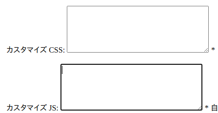

<p align="center">


</p>

# 晴れ Hare

> Let the language come to you. -Steve Kaufmann

Hare ([see definition][hare-translation]) is a Japanese web dictionary that is

* Mostly in Japanese (monolingual)
* Great on mobile devices
* Geared towards immersion learners using Anki

The dictionary is free to use and requires the installation of no extra
software.

## Screenshots

<p align="center" style="margin:0">
   
  
  
  
</p>

## Features

### 🌴 Quality of life

* **Easy to get started with**. Requires the installation of no software, no
  permissions, no manual updating or downloading and configuring dictionaries of
  any kind
* Has a **dark theme** that is great for people with sensitive eyes
* Includes a selection of the most useful monolingual dictionaries
* **Works on any device** that has a modern web browser. You decide your own
  study workflow with your available desktop/laptop/tablet/mobile device
  combinations

No complicated, technical or boring stuff. It works great out of the box and
doesn't give you a headache.

### 📖 Read effectively

* Display **furigana** in all search results
* **Shows the most frequently used definitions first** and rarer ones below. No
  more looking at 20 definitions of the same word and wondering which one you
  should learn

### 🔍 External searches and exporting

* Search any word using an external site:
  * Google image search
  * Google image search for *illustrations*
  * Jisho.org English definition
  * Jisho.org Example sentences
  * Native audio example sentences from https://sentencesearch.neocities.org
* **Copy a word and its definition** for pasting into an Anki card or elsewhere.

They say a picture is worth a thousand words, but sometimes an example sentence
can be worth even more. *These features work great with a clipboard manager that
can store multiple snippets such as GBoard for Android (by Google)*

### 🚀 Fast and intuitive

* **Less waiting** for a better study flow. Searches all dictionaries at the
  same time so that there is no need to wait when switching dictionaries
* **Click any word in any definition to search for it recursively**. Use a Japanese
  dictionary to read a Japanese dictionary!
* **Remembers all search results** that you have done. If you need to re-search
  anything, the result will already be available without a need to wait
* **Never get lost due to accidentally clicking away** from your definition. You
  can always return to where you were using the browser's back and forward
  buttons. Everything is saved to your browser history and will be available
  instantly because of caching

Reading Japanese is hard. That's why it's important to have a great study flow.
You should never have to wait without a good reason. Searching should be easy so
you actually do it even when you're tired.

## Getting started

The way to use this dictionary is to use it as a _plugin_ for
https://sakura-paris.org/dict/, a free online Japanese dictionary site. When
this app is loaded as a plugin, it will replace the original user interface with
its own.

* Copy the code below.

  _(mobile users may need to click the code once to have a copy button show up)_

  ```
  !function(e){var t={};function r(n){if(t[n])return t[n].exports;var o=t[n]={i:n,l:!1,exports:{}};return e[n].call(o.exports,o,o.exports,r),o.l=!0,o.exports}r.m=e,r.c=t,r.d=function(e,t,n){r.o(e,t)||Object.defineProperty(e,t,{enumerable:!0,get:n})},r.r=function(e){"undefined"!=typeof Symbol&&Symbol.toStringTag&&Object.defineProperty(e,Symbol.toStringTag,{value:"Module"}),Object.defineProperty(e,"__esModule",{value:!0})},r.t=function(e,t){if(1&t&&(e=r(e)),8&t)return e;if(4&t&&"object"==typeof e&&e&&e.__esModule)return e;var n=Object.create(null);if(r.r(n),Object.defineProperty(n,"default",{enumerable:!0,value:e}),2&t&&"string"!=typeof e)for(var o in e)r.d(n,o,function(t){return e[t]}.bind(null,o));return n},r.n=function(e){var t=e&&e.__esModule?function(){return e.default}:function(){return e};return r.d(t,"a",t),t},r.o=function(e,t){return Object.prototype.hasOwnProperty.call(e,t)},r.p="",r(r.s=0)}([function(e,t,r){"use strict";r.r(t);var n;(n="".concat("https://sp3ctum.github.io/hare","/loader.js"),new Promise((function(e,t){var r=document.createElement("script");r.src=n,r.onload=function(){console.log("Loaded file ".concat(n,'"')),e(r)},r.onerror=function(){return t(new Error("Style load error for ".concat(src)))},document.head.appendChild(r)}))).then((function(){window.load()}))}]);;
  ```

* Open https://sakura-paris.org/dict/ and go to its settings

  The settings can be found under the cog icon.
  

* Find the place where it says `カスタマイズ JS: ` and paste the previously copied code there
  
* Close the settings window
* Reload the page

Now the application will load every time you refresh the page.

[](https://github.com/sp3ctum/hare/actions/workflows/codeql-analysis.yml)

[hare-translation]: https://www.deepl.com/translator#ja/en/%E3%81%AF%E3%82%8C%E3%80%90%E6%99%B4%E3%82%8C%E3%80%91%E3%80%90%E6%99%B4%E3%80%91%EF%BC%8A%5B2%5D%0A%E3%81%AF%E3%82%8C%E3%80%90%E6%99%B4%E3%82%8C%E3%80%91%E3%80%90%E6%99%B4%E3%80%91%EF%BC%8A%5B2%5D%0A(%E4%B8%80)%E7%A9%BA%E3%81%8C%E6%99%B4%E3%82%8C%E3%81%A6%E3%81%84%E3%82%8B%E3%81%93%E3%81%A8%E3%80%82%0A(%E4%BA%8C)%E7%96%91%E3%81%84%E3%81%8C%E6%99%B4%E3%82%8C%E3%82%8B%E3%81%93%E3%81%A8%E3%80%82%0A%E3%80%8C%E2%80%95%E3%81%AE%E8%BA%AB%E3%81%AB%E3%81%AA%E3%82%8B%E3%80%8D%0A(%E4%B8%89)%E3%81%B5%E3%81%A0%E3%82%93%E3%81%8B%E3%82%89%E5%BE%85%E3%81%A1%E6%9C%9B%E3%82%93%E3%81%A7%E3%81%84%E3%81%9F%E3%80%81%E3%82%81%E3%81%A3%E3%81%9F%E3%81%AB%E3%81%AA%E3%81%84%E6%A9%9F%E4%BC%9A%E3%81%A7%E3%81%82%E3%82%8B%E3%81%93%E3%81%A8%E3%80%82
