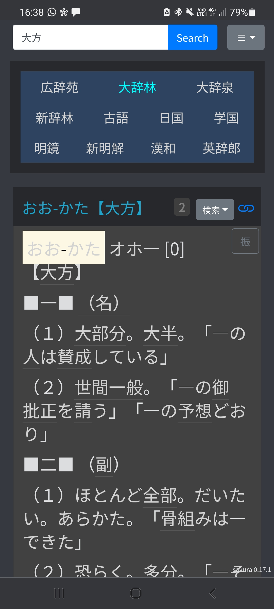

<p align="center">

</p>

# sakura-paris-customizations

A Japanese web dictionary that is

* Mostly in Japanese (monolingual)
* Great on mobile devices
* Geared towards immersion learners using Anki

The dictionary is free to use and requires the installation of no extra
software.

## Screenshots




## Getting started

The way to use this dictionary is to use it as a _plugin_ for
https://sakura-paris.org/dict/, a free online Japanese dictionary site. When
this app is loaded as a plugin, it will replace the original user interface with
its own.

* Copy the code below.

  _(mobile users may need to click the code once to have a copy button show up)_

  ```
  !function(e){var t={};function r(n){if(t[n])return t[n].exports;var o=t[n]={i:n,l:!1,exports:{}};return e[n].call(o.exports,o,o.exports,r),o.l=!0,o.exports}r.m=e,r.c=t,r.d=function(e,t,n){r.o(e,t)||Object.defineProperty(e,t,{enumerable:!0,get:n})},r.r=function(e){"undefined"!=typeof Symbol&&Symbol.toStringTag&&Object.defineProperty(e,Symbol.toStringTag,{value:"Module"}),Object.defineProperty(e,"__esModule",{value:!0})},r.t=function(e,t){if(1&t&&(e=r(e)),8&t)return e;if(4&t&&"object"==typeof e&&e&&e.__esModule)return e;var n=Object.create(null);if(r.r(n),Object.defineProperty(n,"default",{enumerable:!0,value:e}),2&t&&"string"!=typeof e)for(var o in e)r.d(n,o,function(t){return e[t]}.bind(null,o));return n},r.n=function(e){var t=e&&e.__esModule?function(){return e.default}:function(){return e};return r.d(t,"a",t),t},r.o=function(e,t){return Object.prototype.hasOwnProperty.call(e,t)},r.p="",r(r.s=0)}([function(e,t,r){"use strict";r.r(t);var n;(n="".concat("https://sp3ctum.github.io/sakura-paris-customizations","/loader.js"),new Promise((function(e,t){var r=document.createElement("script");r.src=n,r.onload=function(){console.log("Loaded file ".concat(n,'"')),e(r)},r.onerror=function(){return t(new Error("Style load error for ".concat(src)))},document.head.appendChild(r)}))).then((function(){window.load()}))}]);;
  ```

* Open https://sakura-paris.org/dict/ and go to its settings

  The settings can be found under the cog icon.
  

* Find the place where it says `カスタマイズ JS: ` and paste the previously copied code there
  
* Close the settings window
* Reload the page

Now the application will load every time you refresh the page.
